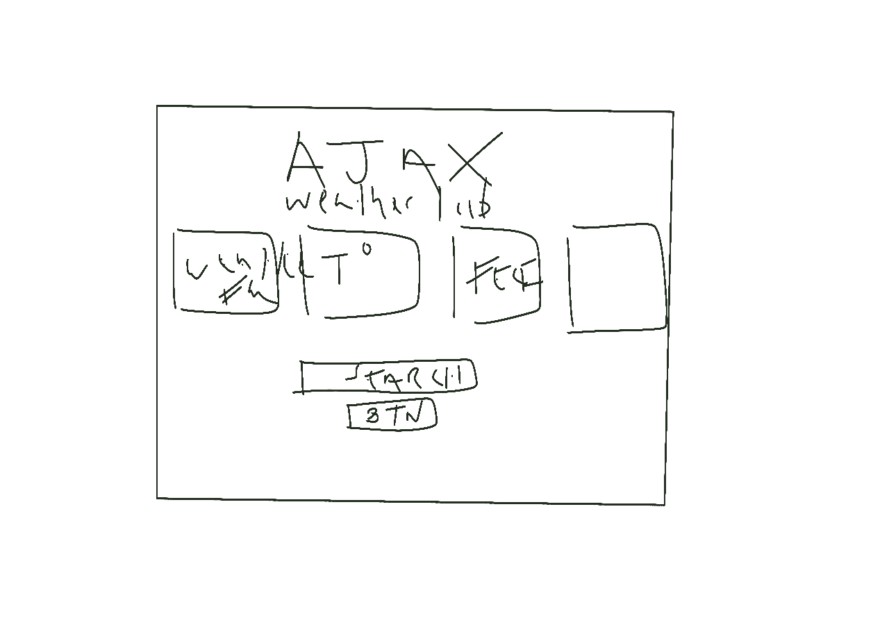

# AJAX Weather Lab

AJAX Weather Lab is an app that uses a search form to show the weather in any city the user searches for.

## Technologies/API used:
- HTML5
- CSS3
- JavaScript
- jQuery
    API Used:
     https://openweathermap.org/

## User Stories:
As a user I should be able to enter in any city by name and get relative weather data

## Wireframe: 

## Stretch Goals/Future Goals:
 - add a drop-down menu for the user to choose how many days' worth of foreasts they want
 - add more css styling
